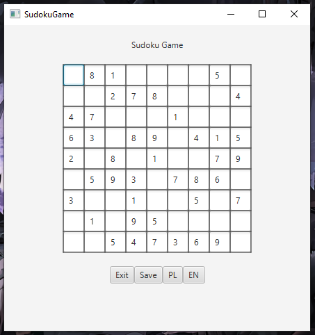

# Sudoku

  

### EN

Project of a game written in `Java` for the `'Component-based Development'` classes. 
The project is written strictly using the `object-oriented programming` methodology with 
imposed constructs of component-based software engineering, where we provide communication between different layers of logic.

### PL

Projekt gry napisany w `Java'ie` na przedmiot `'Programowanie Komponentowe'`. 
Pisany ściśle metodyką `programowania obiektowego` z 
narzuconymi konstuktami ów programowania komponetowego, gdzie tworzymy komunikacje pomiędzy warstwami logiki.
